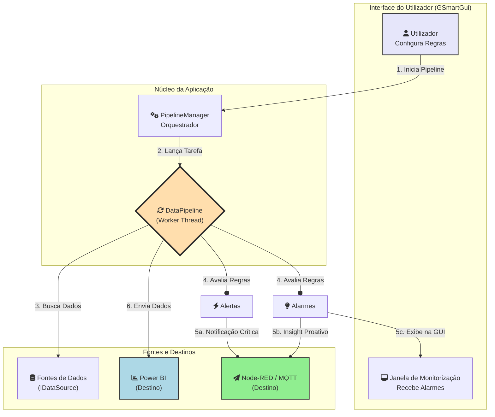

# GSmart - Pipeline de Processamento de Dados IoT v5.0 🚀

O **GSmart** é uma aplicação de desktop ETL (Extração, Transformação e Carga) construída com Java Swing. Ele fornece uma interface visual para criar, gerir e monitorizar robustos pipelines de dados, conectando-se a várias fontes de IoT e enviando os dados processados para plataformas de Business Intelligence.

A versão 5.0 introduz um **motor de regras duplo e totalmente configurável**, transformando o GSmart numa plataforma de inteligência proativa.

---

### ✨ Principais Funcionalidades

| Funcionalidade                | Descrição |
|------------------------------|-----------|
| **Conectividade Multi-Fonte** | Conecte-se nativamente à API da plataforma de IoT **ThingsBoard** ou a bases de dados espelho via **JDBC**. |
| **Processamento em Tempo Real** | Cada pipeline é executado numa thread separada para garantir uma UI responsiva durante o processamento de dados. |
| **Motor de Alertas Configurável** | Crie regras personalizadas que disparam notificações críticas e imediatas via **MQTT** quando as condições são satisfeitas. |
| **Motor de Alarmes (Insights)** | Defina regras para gerar inteligência e observações proativas (ex: "Consumo de energia elevado"), que são exibidas na aplicação e enviadas para um tópico MQTT separado. |
| **Exportação para Power BI** | Envie os dados processados diretamente para um conjunto de dados de streaming no **Microsoft Power BI**. |
| **Persistência de Configuração** | Salva as suas últimas configurações de URLs e fontes de dados para um fluxo de trabalho mais rápido. |

---

### 🏛️ Arquitetura e Fluxo de Dados (v5.0)

O projeto segue uma arquitetura modular que separa a interface, a orquestração e o processamento de dados. O diagrama abaixo ilustra o novo fluxo de dados.



---

### 🛠️ Tecnologias Utilizadas

- **Linguagem:** Java 17
- **Framework:** Swing (para a GUI)
- **Build:** Apache Maven
- **Bibliotecas Principais:**
    - **OkHttp:** Para requisições HTTP (API do ThingsBoard, Node-RED)
    - **PostgreSQL JDBC Driver:** Para conectividade com a base de dados
    - **Gson:** Para parsing e manipulação de JSON
    - **SLF4J & Logback:** Para um sistema de logging robusto
    - **exp4j:** Para avaliação de expressões matemáticas nas métricas
    - **JavaParser:** Para a geração automática de documentação

---

### ⚙️ Como Construir e Executar

Este projeto é gerido pelo Apache Maven.

#### Pré-requisitos

- Java JDK 17 ou superior
- Apache Maven configurado nas variáveis de ambiente do seu sistema

#### Passos para Construir

1. Clone o repositório:
    ```bash
    git clone [URL_DO_SEU_REPOSITORIO]
    cd GSmart
    ```

2. Construa com o Maven:
    ```bash
    mvn clean package
    ```

Isso irá compilar o código, resolver as dependências e criar um JAR executável na pasta `target/`.

#### Executar a Aplicação

Após a construção, o JAR principal estará disponível. Execute-o com o seguinte comando:

```bash
java -jar target/GSmart-Processador-gui.jar
```

---

### 📖 Documentação

A documentação completa do projeto, incluindo a referência da API, pode ser visualizada localmente.

1. Navegue para a pasta da documentação:
    ```bash
    cd gsmart-docs
    ```

2. Inicie o servidor local:
    ```bash
    mkdocs serve
    ```

3. Acesse via navegador:
    ```
    http://127.0.0.1:8000
    ```
