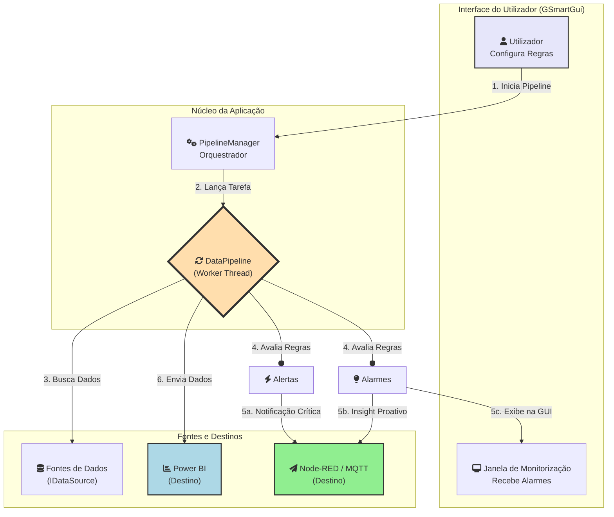

# Visão Geral do Projeto GSmart v5.0

## 1. Introdução

O **GSmart** é uma aplicação de desktop desenvolvida em Java com a biblioteca Swing. Na sua versão 5.0, ele evoluiu de uma simples ferramenta de ETL para uma **plataforma de monitorização e inteligência de dados**.

O seu objetivo principal é conectar-se a fontes de dados como a plataforma de IoT **ThingsBoard** ou bases de dados, e processar essa informação através de um **motor de regras duplo e configurável**, permitindo a geração de **Alertas** críticos e **Alarmes** proativos. Os dados tratados e os eventos gerados podem ser enviados para o **Microsoft Power BI** e para sistemas externos via **MQTT**.

## 2. Arquitetura e Componentes

O projeto segue uma arquitetura modular que separa a interface do utilizador, a gestão de pipelines e o processamento de regras. O diagrama abaixo ilustra o fluxo principal da aplicação na sua versão atual.

